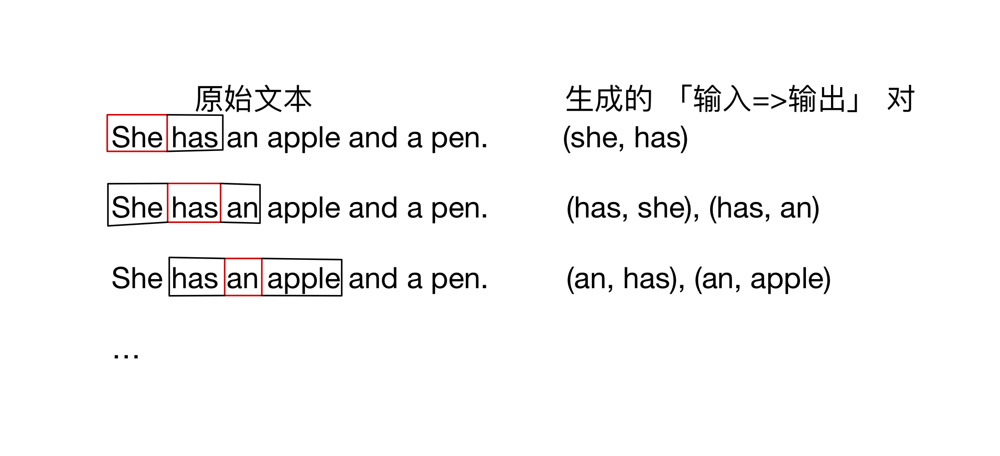
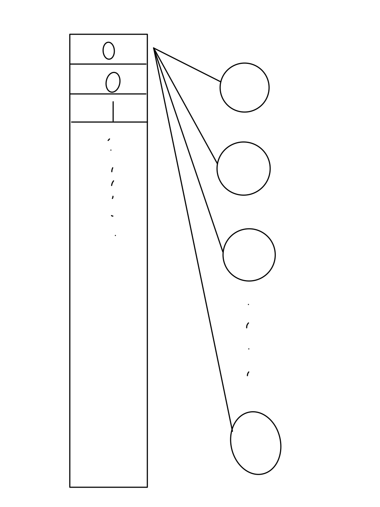

# 前言
类似 auto encoder, 这个也是模型其实并不复杂，只是想法相当新颖，并且也是只是用了模型的部分。

# 模型构建
本质上这个模型可以简化成3层结构。  
```
输入 => 隐藏层 => 输出  
```
模型的最终结果是输出一个词，模型给出可能出现的周围的词。  

比如： 输出 “我”  
模型可能给出： 帅气的｜美丽的｜是｜在  
这些词通常用在“我”的周围。

# 数据构建示例  
这里假设窗口大小为3.  


当然我们首先需要使用one-hot编码对输入进行编码。  
假设一共有1000种输入，并且she是第三种输入， 那么 she 可以表示为 [0,0,1,0,0,....,0,]，得到了一个1000长度的输入张量  
其他词同理。  


与此对应，输出也是一个1000长度的张量，但是每一位都是概率值，并且各位和为1（因为经过了softmax层）  
概率最大的位置就是模型给出的预测词对应的索引，可以反查输入到one-hot的映射表得到最终结果。

# 模型细节
1. 假设隐藏层有256个神经元。  
2. 全连接。

那么这 1000x1 的张量经过隐藏层会变成 1000x256 的张量。(每一个元素会分别和256个神经元操作，总共1000个)


这样我们实现了对每个词描述的维度从 1=>256 的转换，我们就可以把这长度为 256 的向量拿出来，作为这个词的向量表示。

我们也可以将隐藏层张量视为一个查询表

> 被引用文章中两幅图很形象  
> 词维度转换  
>   
> 词向量到查询表  
> 


**到此我们就完成了从词到向量的整个步骤，至于输出层，暂时就没啥用了。模型截断到这里就解决任务了**  
------------------------------------------------  

更多内容请看引用

# reference｜引用
[McCormick, C. (2016, April 19). Word2Vec Tutorial - The Skip-Gram Model.](http://mccormickml.com/2016/04/19/word2vec-tutorial-the-skip-gram-model/)